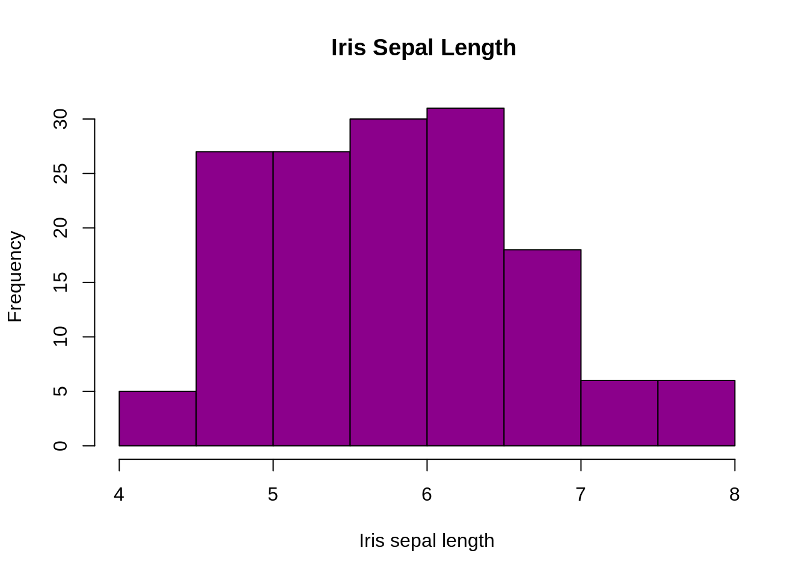
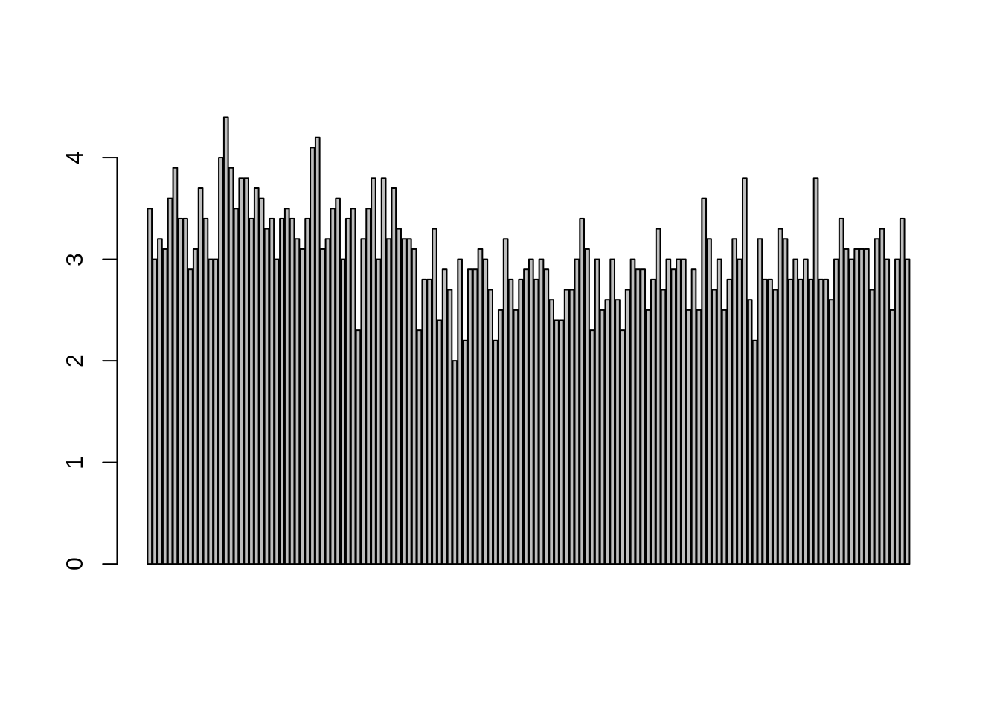
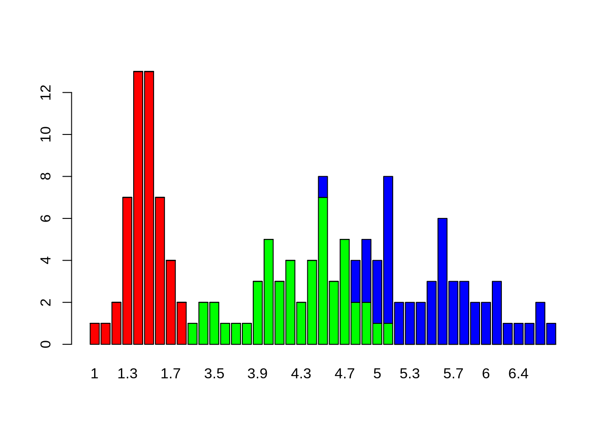
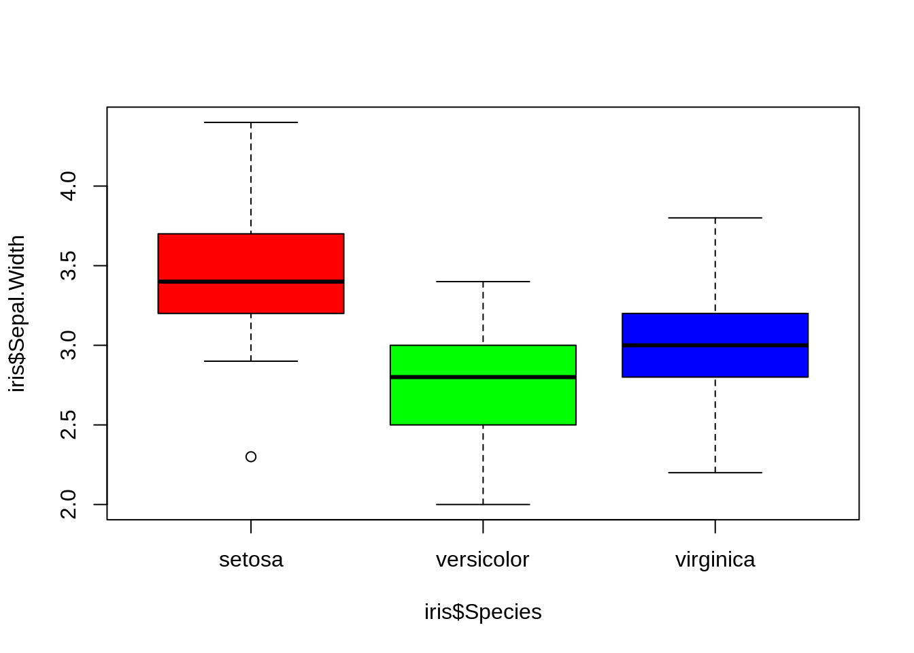
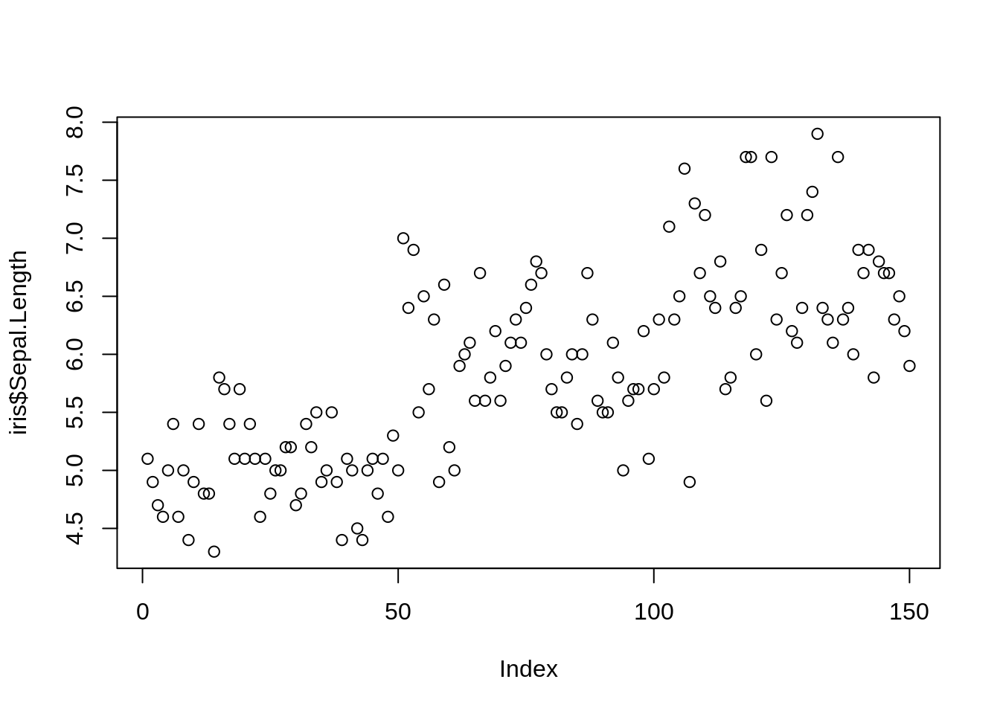
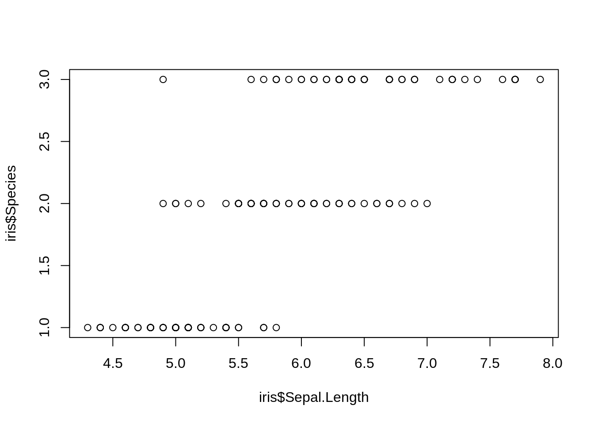
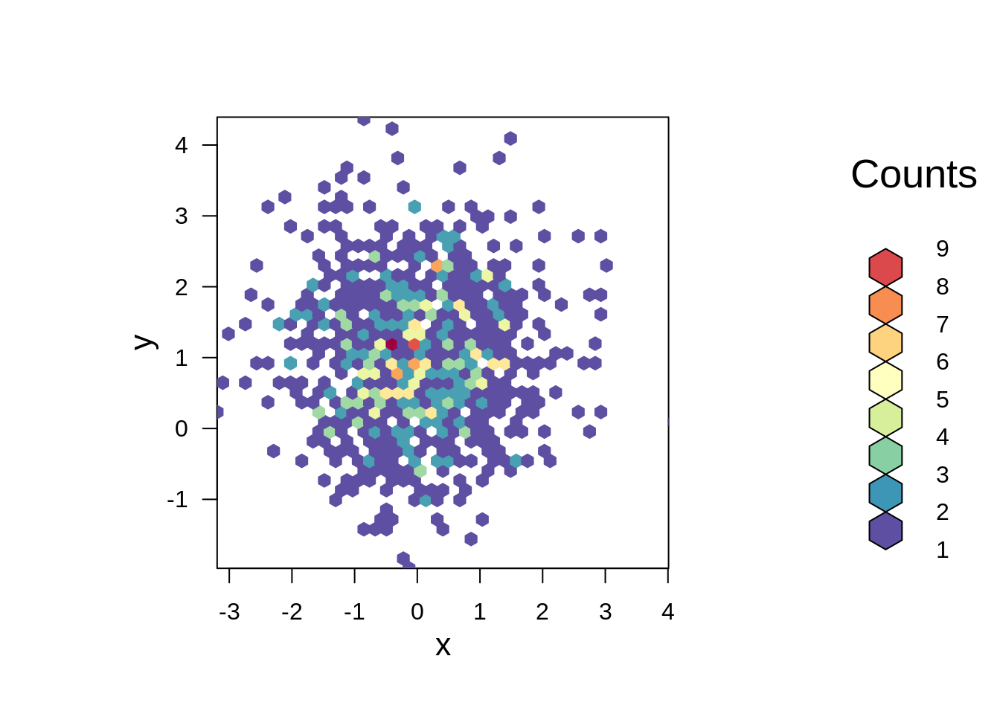
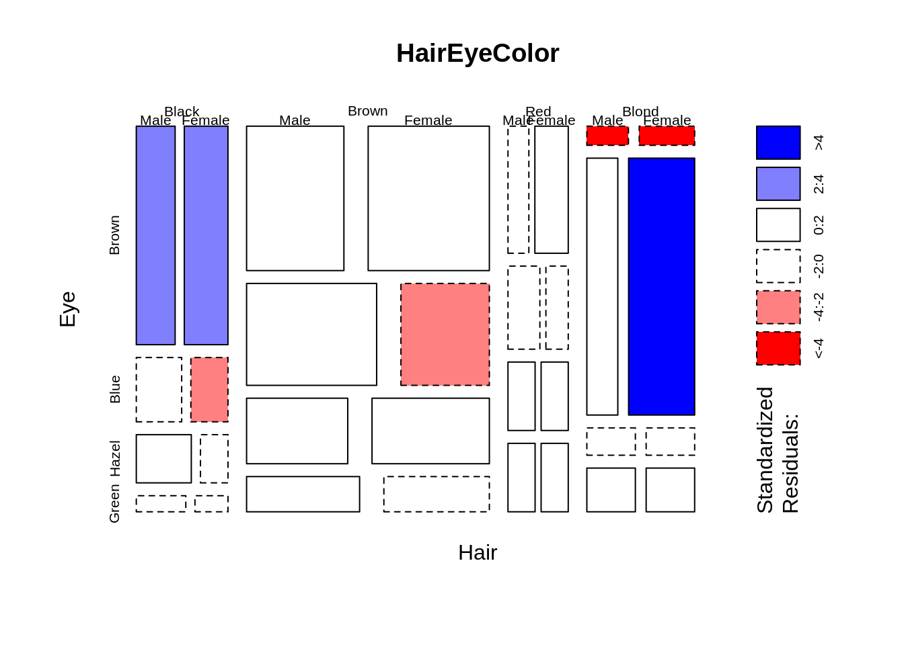
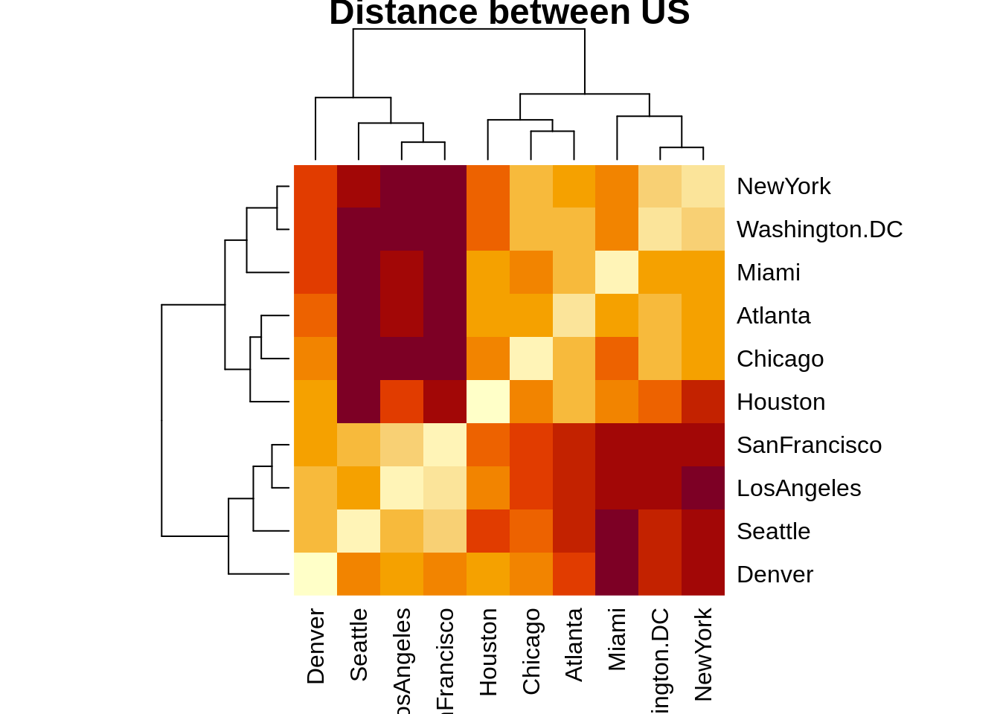

# Basic data visualization cheatsheet

Yue Ma

# Histogram
A histogram represents the frequencies of values of a variable bucketed into ranges. Histogram is similar to bar chat but the difference is it groups the values into continuous ranges. Each bar in histogram represents the height of the number of values present in that range.


```r
# histogram with added parameters
hist(iris$Sepal.Length,
main="Iris Sepal Length ",
xlab="Iris sepal length",
xlim=c(4,8),
col="darkmagenta"
)
```



# Barplot

```r
barplot(iris$Sepal.Width)
```



```r
barplot(table(iris$Species,iris$Petal.Length),col=rainbow(3))
```


# Box Plot
A boxplot, also called a box and whisker plot, is a way to show the spread and centers of a data set. Measures of spread include the interquartile range and the mean of the data set. Measures of center include the mean or average and median (the middle of a data set).


```r
boxplot(iris$Sepal.Width)
```


```r
boxplot(iris$Sepal.Width~iris$Species,col= rainbow(3))
```


# Scatterplot
A scatter plot (aka scatter chart, scatter graph) uses dots to represent values for two different numeric variables.


```r
plot(iris$Sepal.Length)
```



```r
plot(iris$Sepal.Length,iris$Species)
```




```r
plot(iris)
```


# Hexbin Binning
A hexagonal bin plot is created by covering the data range with a regular array of hexagons and coloring each hexagon according to the number of observations it covers.


```r
library(hexbin)
library(RColorBrewer)

x <- rnorm(mean=0, 1000)
y <- rnorm(mean=1, 1000)

bin<-hexbin(x, y, xbins=40)
colors=colorRampPalette(rev(brewer.pal(11,'Spectral')))
plot(bin , colramp=colors ) 
```


# Mosaic Plot
A mosaic plot is a special type of stacked bar chart. For two variables, the width of the columns is proportional to the number of observations in each level of the variable plotted on the horizontal axis.


```r
mosaicplot(HairEyeColor,shade=TRUE)
```



# Heatmap
Heat maps are a graphical representation of data over a given area in terms of color.


```r
x = data.matrix(UScitiesD)
heatmap(x,main = "Distance between US")
```


# Count map

```r
library(ggplot2)
data(iris,package="ggplot2")

theme_set(theme_bw())
g<-ggplot(iris,aes(Sepal.Width,Species))
g+geom_count(col="tomato3",show.ledegnd=F)+
  labs(subtitle="Species vs width",
       title="Counts plot")
```


