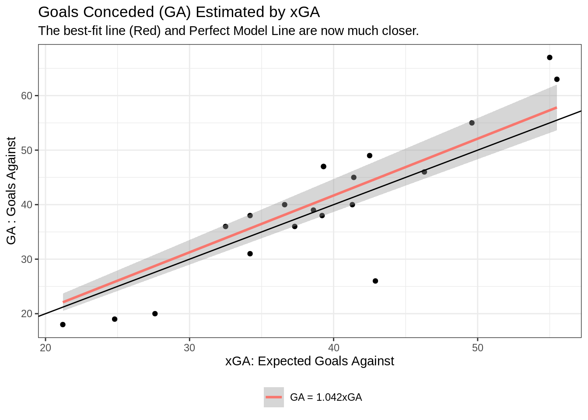
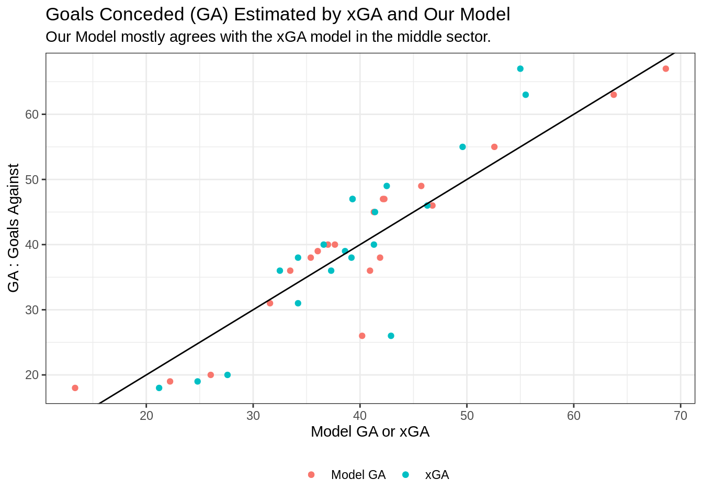

# Linear Modeling Using R via a Soccer Example

Fahad Alkhaja


## Introduction

The goal of this assignment and tutorial is to show how one can use linear models 
in R to describe trends and be used as a predictive measure of future performance.

A commonly used model in the soccer world is that of xG, which roughly translates to
the Expectation of a Goal being scored. $E(Goal) =$xG.

It is based on a probabilistic measure being assigned to each shot taken where each
shot has an xG value based on likelihood of scoring from where the shot was taken.
The xG values are thus tallied for a team. Thus, comparing xG values for teams
over the course of a game or year can serve as a good indication of team performance
without results bias and excluding for the most part luck, which in a low 
scoring game such as soccer plays a big factor.

Today, we will be exploring a more niche aspect of the expectations world in soccer.
We will look to model the number of goals conceded based on some different parameters which include xGA expected goals against, or expected goals conceded, and some other defensive metrics such as Blocks, Tackles, and Pressures. This can help be a guide to see which factor is the most contributing to a team's defensive record, in terms of goals conceded. Eventually this could be used to compare to that of the league table.

## Data Loading

The Data used here is obtained directly from the FBref website under the Premier
League 2021/22 season so far as of Mar 28, 2021 (1).


```r
league_table <- read_xlsx("resources/linear_models_soccer_example/PL21-22_Points.xlsx",
                          skip = 0) 
# Squad Standard Stats 2021-22 Premier League Table on FBRef

defense <- read_xlsx("resources/linear_models_soccer_example/PL21-22_Defense.xlsx",skip = 1)
# Squad Defensive Actions 2021-22 Premier League Table on FBRef
```

## Data Wrangling

We have to then clean and prepare the relevant data so we can come up with appropriate models.


```r
league_table_2 <- league_table %>%
  select(Rk:`xGD/90`) %>%
  mutate(`xGA/90` = round(xGA/MP, 3),
         PPG = round(Pts/MP, 3)) %>%
  select(-c(W,D,L))

defense_2 <- defense %>%
  select(-(`# Pl`)) %>%
  select(-(`TklW`:Past)) %>%
  select(-(Sh:Pass)) %>%
  rename(Tackles = `Tkl...4`,
         Pressures = Press,
         SuccPress = Succ,
         `%SuccPress` = `%`,
         Press_Def = `Def 3rd...16`,
         Press_Mid = `Mid 3rd...17`,
         Press_Att = `Att 3rd...18`) %>%
  select(-c(`Tkl+Int`))
  
defense_stats_cleaned <- league_table_2 %>%
  full_join(defense_2, by = "Squad") %>%
  select(-c(`90s`, GF, GD, xG, xGD, `xGD/90`))

defense_stats_cleaned
```

```
## # A tibble: 20 × 19
##       Rk Squad             MP    GA   Pts   xGA `xGA/90`   PPG Tackles Pressures
##    <dbl> <chr>          <dbl> <dbl> <dbl> <dbl>    <dbl> <dbl>   <dbl>     <dbl>
##  1     1 Manchester Ci…    29    18    70  21.2    0.731 2.41      387      3265
##  2     2 Liverpool         29    20    69  27.6    0.952 2.38      422      4014
##  3     3 Chelsea           28    19    59  24.8    0.886 2.11      480      3989
##  4     4 Arsenal           28    31    54  34.2    1.22  1.93      430      3458
##  5     5 Tottenham         29    36    51  32.5    1.12  1.76      532      4348
##  6     6 Manchester Utd    29    40    50  41.3    1.42  1.72      481      3802
##  7     7 West Ham          30    39    48  38.6    1.29  1.6       466      3881
##  8     8 Wolves            30    26    46  42.9    1.43  1.53      579      4317
##  9     9 Aston Villa       29    40    36  36.6    1.26  1.24      524      4036
## 10    10 Leicester City    27    46    36  46.3    1.72  1.33      542      4234
## 11    11 Southampton       29    45    35  41.4    1.43  1.21      506      4366
## 12    12 Crystal Palace    29    38    34  34.2    1.18  1.17      567      4670
## 13    13 Brighton          29    36    33  37.3    1.29  1.14      566      4313
## 14    14 Newcastle Utd     29    49    31  42.5    1.47  1.07      532      4095
## 15    15 Brentford         30    47    30  39.3    1.31  1         560      4372
## 16    16 Leeds United      30    67    29  55      1.83  0.967     650      5224
## 17    17 Everton           27    47    25  39.3    1.46  0.926     576      4477
## 18    18 Watford           29    55    22  49.6    1.71  0.759     535      4422
## 19    19 Burnley           27    38    21  39.2    1.45  0.778     465      3899
## 20    20 Norwich City      29    63    17  55.5    1.91  0.586     528      4626
## # … with 9 more variables: SuccPress <dbl>, `%SuccPress` <dbl>,
## #   Press_Def <dbl>, Press_Mid <dbl>, Press_Att <dbl>, Blocks <dbl>, Int <dbl>,
## #   Clr <dbl>, Err <dbl>
```
## Initial Model Fit: Simple Linear Model (one variable)

Now that we have cleaned the data to only the relevant defensive metrics that we
will be exploring, we can get to work.

First we will attempt to fit a  linear model (lm) using only xGA to estimate xG.

The "lm" function takes the "formula" argument in the form y~x such that it runs
a linear regression with the equation $$ y = \beta_0 + \beta_1x$$.
In the case of more parameters the equation takes the same linear form :
$$y = \beta_0 + \beta_1x_1 + \beta_2x_2 + ... + \beta_nx_n$$.

As seen below, the lm(...) function serves to find the best estimates for each $\beta$.
Running the function summary(lm(...)) as such gives a much more detailed view 
including standard errors of such estimations.


```r
# running lm on the model finds the best estimates for beta_0 (the intercept)
# and beta_1 in this case.

model_1 <- lm(formula = GA ~ xGA, data = defense_stats_cleaned)

model_1
```

```
## 
## Call:
## lm(formula = GA ~ xGA, data = defense_stats_cleaned)
## 
## Coefficients:
## (Intercept)          xGA  
##      -13.00         1.36
```

```r
summary_model_1 <- summary(model_1)

summary(model_1)
```

```
## 
## Call:
## lm(formula = GA ~ xGA, data = defense_stats_cleaned)
## 
## Residuals:
##      Min       1Q   Median       3Q      Max 
## -19.3528  -2.3693   0.5201   4.2639   6.5443 
## 
## Coefficients:
##             Estimate Std. Error t value Pr(>|t|)    
## (Intercept)  -13.005      6.143  -2.117   0.0485 *  
## xGA            1.360      0.154   8.836 5.79e-08 ***
## ---
## Signif. codes:  0 '***' 0.001 '**' 0.01 '*' 0.05 '.' 0.1 ' ' 1
## 
## Residual standard error: 5.919 on 18 degrees of freedom
## Multiple R-squared:  0.8126,	Adjusted R-squared:  0.8022 
## F-statistic: 78.07 on 1 and 18 DF,  p-value: 5.79e-08
```
We can see that the intercept has a large variation. Inherently also, the value does not make sense because teams starting with an xGA of 0 will have an estimated GA of around -13.

We can also visualize this initial model with a simple scatter plot and a best fit line and an ideal model line, where GA = xGA, it is a perfect assumption.


```r
defense_stats_cleaned %>%
  ggplot(aes(xGA, GA)) +
  geom_point() +
  geom_smooth(method='lm', formula= y~x, aes(color = "GA = -13.005 + 1.360 xGA")) +
  geom_abline(slope = 1, intercept = 0) +
  theme_bw() +
  labs(title = "Goals Conceded (GA) Estimated by xGA",
       subtitle = "There is a lot of variance around the estimated best fit line.",
       x = "xGA: Expected Goals Against",
       y = "GA : Goals Against",
       color = "") +
  theme(legend.position = "bottom")
```


It is immediately clear that the simple model we ran is not sufficient, so how can we improve it?

## Linear Model: Removing Intercept Term

First, we can get rid of the intercept because fundamentally in our problem here it does not make sense.

Adding a -1 at the end of the formula gets rid of the intercept term.
such that formula = y ~ x - 1.


```r
model_2 <- lm(formula = GA ~ xGA - 1, data = defense_stats_cleaned)

model_2
```

```
## 
## Call:
## lm(formula = GA ~ xGA - 1, data = defense_stats_cleaned)
## 
## Coefficients:
##   xGA  
## 1.042
```

```r
summary_model_2 <- summary(model_2)

summary(model_2)
```

```
## 
## Call:
## lm(formula = GA ~ xGA - 1, data = defense_stats_cleaned)
## 
## Residuals:
##      Min       1Q   Median       3Q      Max 
## -18.7042  -3.3006   0.3178   3.6637   9.6870 
## 
## Coefficients:
##     Estimate Std. Error t value Pr(>|t|)    
## xGA  1.04206    0.03608   28.88   <2e-16 ***
## ---
## Signif. codes:  0 '***' 0.001 '**' 0.01 '*' 0.05 '.' 0.1 ' ' 1
## 
## Residual standard error: 6.439 on 19 degrees of freedom
## Multiple R-squared:  0.9777,	Adjusted R-squared:  0.9766 
## F-statistic: 834.1 on 1 and 19 DF,  p-value: < 2.2e-16
```

```r
defense_stats_cleaned %>%
  ggplot(aes(xGA, GA)) +
  geom_point() +
  geom_smooth(method='lm', formula= y~x-1, aes(color = "GA = 1.042xGA")) +
  geom_abline(slope = 1, intercept = 0) +
  theme_bw() +
  labs(title = "Goals Conceded (GA) Estimated by xGA",
       subtitle = "The best-fit line (Red) and Perfect Model Line are now much closer.",
       x = "xGA: Expected Goals Against",
       y = "GA : Goals Against",
       color = "") +
  theme(legend.position = "bottom")
```


The line does seem to fit the ideal model line very well. However, there are still alot of data points quite spread it. So it is definitely worth exploring more parameters to see which one best fits our current data.


## Additional Linear Parameters and Interactions

There are several methods to do this. We can add more linear terms and have our pick from any of the defensive metrics we narrowed down earlier. In addition to adding more linear terms we can also add interaction terms and even if necessary higher order powered terms. Outlined below is how to do such a thing.

Additional Linear Terms follow the formula outline earlier.

$$y = \beta_0 + \beta_1x_1 + ... \beta_nx_n$$

In R, this would be done by ```lm(y ~ x1 + ... + xn)```.

For interaction terms, there are two operators that can be used.

The " * " operator or ":" can be used.

y ~ x1 + x2*x3 means y~ x1 + x2 + x3 + x2:x3 

Mathematically, this translates to : 

$$y = \beta_0 + \beta_1x_1 + \beta_2x_2 + \beta_3x_3 + \beta_{2,3}x_2x_3$$
For the next model, we will look at the xGA in additional to the successful pressure percentages of teams, the number of pressures in the attacking third (Press_Att) and the interaction between the successful pressure percentage and Press_Att.


```r
model_3 <- lm(data = defense_stats_cleaned, formula = GA ~ xGA + `%SuccPress`*Press_Att  - 1)

model_3
```

```
## 
## Call:
## lm(formula = GA ~ xGA + `%SuccPress` * Press_Att - 1, data = defense_stats_cleaned)
## 
## Coefficients:
##                    xGA            `%SuccPress`               Press_Att  
##               1.248226               -1.258805                0.060517  
## `%SuccPress`:Press_Att  
##              -0.001056
```

```r
summary_model_3 <- summary(model_3)

summary_model_3
```

```
## 
## Call:
## lm(formula = GA ~ xGA + `%SuccPress` * Press_Att - 1, data = defense_stats_cleaned)
## 
## Residuals:
##      Min       1Q   Median       3Q      Max 
## -11.8788  -3.0068   0.6778   3.2206   7.6546 
## 
## Coefficients:
##                         Estimate Std. Error t value Pr(>|t|)    
## xGA                     1.248226   0.166155   7.512 1.24e-06 ***
## `%SuccPress`           -1.258805   0.467899  -2.690   0.0161 *  
## Press_Att               0.060517   0.037871   1.598   0.1296    
## `%SuccPress`:Press_Att -0.001056   0.001019  -1.036   0.3156    
## ---
## Signif. codes:  0 '***' 0.001 '**' 0.01 '*' 0.05 '.' 0.1 ' ' 1
## 
## Residual standard error: 5.465 on 16 degrees of freedom
## Multiple R-squared:  0.9865,	Adjusted R-squared:  0.9831 
## F-statistic: 292.1 on 4 and 16 DF,  p-value: 9.871e-15
```
$$GA =  1.248226(xGA) -1.258805 (\%SuccPress) + 0.060517(Press_{Att}) - 0.001056(\%SuccPress)(Press_{Att}) $$
While this may not be as easy to interpret and understand it becomes easier after running through an example.

First, a negative coefficient means that an increase in that variable results in a decrease in our interested variable, in this case Goals Against (GA). The higher the Successful Press % (%SuccPress) the lower the GA in general. However, we also have an interaction term to consider. Since our interaction term is negative it means that we can't think of the Press_Att term as increasing to the estimated GA because it has a positive coefficient. We need to consider the interaction term between Press_Att and %SuccPress.

To think of it in a simple manner, if we assume a %SuccPress of 0. Our model estimates the GA to be : 
GA = 1.248226(xGA) + 0.060517(Press_Att). This basically means that with a 0% success rate in pressing the number of goals you will concede (GA) is proportional to the number of Presses Attempted in the Attacking Third (assuming they were all unsuccessful). From this base model, we can observe that an increase in Pressure Success %, results in a decrease of our estimate of GA via the interaction term and the negative coefficient estimate for the %SuccPress parameter. From a soccer point of view, this makes sense because an increase in successful pressure% means the team wins the ball back more and thus a decrease in goals conceded (GA) when you win the ball back more often makes a lot of intuitive sense.

## Grouped Parameters

We can also group some variables/parameters if we are interested in them as a grouped parameter.
One method would be to create a new column in the table itself. The other method would be to use the formula as follows:

Interested grouped variable: x1 + x2 + x3

lm(formula = y ~ I(x1 + x2 + x3), data = data).

Here we group Block, Interception(Int), Clearances (Clr), and Tackles which in the game of Soccer are all means of getting the ball back from the opponent and away from your goal which should decrease the Goals Against (GA).


```r
model_4 <- lm(formula = GA ~ xGA + I(Blocks + Int + Clr + Tackles ) - 1,
              data = defense_stats_cleaned)

model_4
```

```
## 
## Call:
## lm(formula = GA ~ xGA + I(Blocks + Int + Clr + Tackles) - 1, 
##     data = defense_stats_cleaned)
## 
## Coefficients:
##                             xGA  I(Blocks + Int + Clr + Tackles)  
##                         1.39904                         -0.00713
```

```r
summary_model_4 <- summary(model_4)

summary_model_4
```

```
## 
## Call:
## lm(formula = GA ~ xGA + I(Blocks + Int + Clr + Tackles) - 1, 
##     data = defense_stats_cleaned)
## 
## Residuals:
##      Min       1Q   Median       3Q      Max 
## -18.2617  -2.4262  -0.1194   4.7167   8.1955 
## 
## Coefficients:
##                                  Estimate Std. Error t value Pr(>|t|)    
## xGA                              1.399041   0.216459   6.463 4.43e-06 ***
## I(Blocks + Int + Clr + Tackles) -0.007130   0.004268  -1.671    0.112    
## ---
## Signif. codes:  0 '***' 0.001 '**' 0.01 '*' 0.05 '.' 0.1 ' ' 1
## 
## Residual standard error: 6.155 on 18 degrees of freedom
## Multiple R-squared:  0.9807,	Adjusted R-squared:  0.9786 
## F-statistic: 457.7 on 2 and 18 DF,  p-value: 3.686e-16
```
The model agreed with what we expected it to look like with the grouped variable having a negative coefficient meaning an increase in Defensive Activity (via these grouped values) results in lower Goals Against. While the coefficient seems very small the number of actions of this grouped variable is quite large that it does have an effect. 

It is important to note that this model does show xGA having a 1.399 which can result in an overestimation if we have (Blocks + Int + Clr + Tackles) = 0


## AIC : Akaike Information Criterion

Alexandre Zajic says: 
"In plain words, AIC is a single number score that can be used to determine which of multiple models is most likely to be the best model for a given dataset. It estimates models relatively, meaning that AIC scores are only useful in comparison with other AIC scores for the same dataset. A lower AIC score is better." (2)

### Optimum Model Selection

We can use the AIC as a metric to determine which model is the best for our dataset.

To find the model with the optimum AIC, we can use a forward selection  or a backward elimination algorithm. Sometimes one method misses the method with the lower AIC, so it is not necessarily repetitive to do both.


```r
model_all <- lm(GA ~ xGA + `%SuccPress`*Press_Def + `%SuccPress`*Press_Mid + `%SuccPress`*Press_Att
                + Tackles + Blocks + Int + Clr + Err - 1,
                data=defense_stats_cleaned)
model_0 <- lm(GA ~ xGA - 1, data=defense_stats_cleaned)

scope <- list(lower=formula(model_0), upper=formula(model_all))

forward_selection <- step(model_0, direction="forward", scope=scope)
```

```
## Start:  AIC=75.47
## GA ~ xGA - 1
## 
##                Df Sum of Sq    RSS    AIC
## + `%SuccPress`  1   171.994 615.70 72.540
## + Clr           1   126.464 661.23 73.967
## + Blocks        1    91.880 695.81 74.987
## + Int           1    86.381 701.31 75.144
## <none>                      787.69 75.467
## + Press_Att     1    73.245 714.44 75.515
## + Tackles       1    61.365 726.32 75.845
## + Press_Mid     1    60.582 727.11 75.867
## + Err           1    44.706 742.98 76.299
## + Press_Def     1     6.017 781.67 77.314
## 
## Step:  AIC=72.54
## GA ~ xGA + `%SuccPress` - 1
## 
##             Df Sum of Sq    RSS    AIC
## + Press_Att  1   105.835 509.86 70.768
## + Press_Mid  1    65.553 550.14 72.289
## <none>                   615.70 72.540
## + Tackles    1    39.201 576.50 73.225
## + Int        1    21.043 594.65 73.845
## + Press_Def  1    14.922 600.77 74.050
## + Clr        1     9.690 606.01 74.223
## + Blocks     1     4.645 611.05 74.389
## + Err        1     1.163 614.53 74.503
## 
## Step:  AIC=70.77
## GA ~ xGA + `%SuccPress` + Press_Att - 1
## 
##                          Df Sum of Sq    RSS    AIC
## + Tackles                 1    83.695 426.17 69.182
## + Press_Def               1    71.398 438.46 69.751
## + Press_Mid               1    65.025 444.84 70.039
## <none>                                509.86 70.768
## + `%SuccPress`:Press_Att  1    32.052 477.81 71.470
## + Int                     1    19.561 490.30 71.986
## + Blocks                  1    19.342 490.52 71.995
## + Err                     1    15.858 494.00 72.136
## + Clr                     1     6.064 503.80 72.529
## 
## Step:  AIC=69.18
## GA ~ xGA + `%SuccPress` + Press_Att + Tackles - 1
## 
##                          Df Sum of Sq    RSS    AIC
## <none>                                426.17 69.182
## + `%SuccPress`:Press_Att  1   31.4030 394.76 69.651
## + Err                     1   25.9118 400.25 69.927
## + Press_Mid               1    4.6911 421.47 70.961
## + Int                     1    1.3618 424.80 71.118
## + Press_Def               1    0.7302 425.44 71.148
## + Clr                     1    0.1589 426.01 71.174
## + Blocks                  1    0.1086 426.06 71.177
```

```r
backward_elimination <- step(model_all, direction="backward", scope=scope)
```

```
## Start:  AIC=81.11
## GA ~ xGA + `%SuccPress` * Press_Def + `%SuccPress` * Press_Mid + 
##     `%SuccPress` * Press_Att + Tackles + Blocks + Int + Clr + 
##     Err - 1
## 
##                          Df Sum of Sq    RSS    AIC
## - `%SuccPress`:Press_Mid  1     0.205 314.77 79.122
## - Clr                     1     3.393 317.96 79.324
## - `%SuccPress`:Press_Def  1     3.781 318.35 79.348
## - Int                     1     5.643 320.21 79.465
## - `%SuccPress`:Press_Att  1     7.587 322.16 79.586
## - Blocks                  1    19.800 334.37 80.330
## <none>                                314.57 81.109
## - Err                     1    38.361 352.93 81.411
## - Tackles                 1    59.057 373.62 82.550
## 
## Step:  AIC=79.12
## GA ~ xGA + `%SuccPress` + Press_Def + Press_Mid + Press_Att + 
##     Tackles + Blocks + Int + Clr + Err + `%SuccPress`:Press_Def + 
##     `%SuccPress`:Press_Att - 1
## 
##                          Df Sum of Sq    RSS    AIC
## - Clr                     1     3.987 318.76 77.374
## - Int                     1     6.908 321.68 77.557
## - Press_Mid               1     7.993 322.77 77.624
## - `%SuccPress`:Press_Def  1     9.366 324.14 77.709
## - Blocks                  1    20.872 335.64 78.406
## - `%SuccPress`:Press_Att  1    23.388 338.16 78.556
## <none>                                314.77 79.122
## - Err                     1    43.548 358.32 79.714
## - Tackles                 1    75.544 390.32 81.425
## 
## Step:  AIC=77.37
## GA ~ xGA + `%SuccPress` + Press_Def + Press_Mid + Press_Att + 
##     Tackles + Blocks + Int + Err + `%SuccPress`:Press_Def + `%SuccPress`:Press_Att - 
##     1
## 
##                          Df Sum of Sq    RSS    AIC
## - Int                     1     2.989 321.75 75.561
## - Press_Mid               1     6.058 324.82 75.751
## - `%SuccPress`:Press_Def  1     8.519 327.28 75.902
## - Blocks                  1    17.631 336.39 76.451
## - `%SuccPress`:Press_Att  1    21.724 340.48 76.693
## <none>                                318.76 77.374
## - Err                     1    41.208 359.97 77.806
## - Tackles                 1    76.273 395.03 79.665
## 
## Step:  AIC=75.56
## GA ~ xGA + `%SuccPress` + Press_Def + Press_Mid + Press_Att + 
##     Tackles + Blocks + Err + `%SuccPress`:Press_Def + `%SuccPress`:Press_Att - 
##     1
## 
##                          Df Sum of Sq    RSS    AIC
## - Press_Mid               1     6.451 328.20 73.958
## - `%SuccPress`:Press_Def  1     6.477 328.23 73.959
## - `%SuccPress`:Press_Att  1    19.104 340.85 74.714
## - Blocks                  1    23.566 345.31 74.974
## <none>                                321.75 75.561
## - Err                     1    40.402 362.15 75.927
## - Tackles                 1    80.560 402.31 78.030
## 
## Step:  AIC=73.96
## GA ~ xGA + `%SuccPress` + Press_Def + Press_Att + Tackles + Blocks + 
##     Err + `%SuccPress`:Press_Def + `%SuccPress`:Press_Att - 1
## 
##                          Df Sum of Sq    RSS    AIC
## - `%SuccPress`:Press_Def  1     2.123 330.32 72.087
## - `%SuccPress`:Press_Att  1    12.723 340.92 72.719
## - Blocks                  1    17.136 345.34 72.976
## - Err                     1    34.113 362.31 73.936
## <none>                                328.20 73.958
## - Tackles                 1    74.131 402.33 76.031
## 
## Step:  AIC=72.09
## GA ~ xGA + `%SuccPress` + Press_Def + Press_Att + Tackles + Blocks + 
##     Err + `%SuccPress`:Press_Att - 1
## 
##                          Df Sum of Sq    RSS    AIC
## - Blocks                  1    16.465 346.79 71.060
## - Press_Def               1    23.534 353.86 71.463
## - Err                     1    32.236 362.56 71.949
## <none>                                330.32 72.087
## - `%SuccPress`:Press_Att  1    62.065 392.39 73.530
## - Tackles                 1    81.055 411.38 74.476
## 
## Step:  AIC=71.06
## GA ~ xGA + `%SuccPress` + Press_Def + Press_Att + Tackles + Err + 
##     `%SuccPress`:Press_Att - 1
## 
##                          Df Sum of Sq    RSS    AIC
## - Press_Def               1    29.430 376.22 70.689
## <none>                                346.79 71.060
## - Err                     1    44.623 391.41 71.480
## - `%SuccPress`:Press_Att  1    46.408 393.20 71.572
## - Tackles                 1    71.900 418.69 72.828
## 
## Step:  AIC=70.69
## GA ~ xGA + `%SuccPress` + Press_Att + Tackles + Err + `%SuccPress`:Press_Att - 
##     1
## 
##                          Df Sum of Sq    RSS    AIC
## - Err                     1    18.545 394.76 69.651
## - `%SuccPress`:Press_Att  1    24.036 400.25 69.927
## <none>                                376.22 70.689
## - Tackles                 1    91.438 467.66 73.040
## 
## Step:  AIC=69.65
## GA ~ xGA + `%SuccPress` + Press_Att + Tackles + `%SuccPress`:Press_Att - 
##     1
## 
##                          Df Sum of Sq    RSS    AIC
## - `%SuccPress`:Press_Att  1    31.403 426.17 69.182
## <none>                                394.76 69.651
## - Tackles                 1    83.047 477.81 71.470
## 
## Step:  AIC=69.18
## GA ~ xGA + `%SuccPress` + Press_Att + Tackles - 1
## 
##                Df Sum of Sq    RSS    AIC
## <none>                      426.17 69.182
## - Tackles       1    83.695 509.86 70.768
## - Press_Att     1   150.330 576.50 73.225
## - `%SuccPress`  1   283.516 709.68 77.382
```

```r
# Check if the AICs and models from both methods are the same
extractAIC(forward_selection) == extractAIC(backward_elimination)
```

```
## [1] TRUE TRUE
```

```r
summary(backward_elimination)
```

```
## 
## Call:
## lm(formula = GA ~ xGA + `%SuccPress` + Press_Att + Tackles - 
##     1, data = defense_stats_cleaned)
## 
## Residuals:
##     Min      1Q  Median      3Q     Max 
## -14.201  -2.022   2.385   3.064   4.845 
## 
## Coefficients:
##              Estimate Std. Error t value Pr(>|t|)    
## xGA           1.10645    0.18616   5.943 2.06e-05 ***
## `%SuccPress` -1.87594    0.57499  -3.263  0.00489 ** 
## Press_Att     0.02890    0.01217   2.376  0.03035 *  
## Tackles       0.04641    0.02618   1.773  0.09532 .  
## ---
## Signif. codes:  0 '***' 0.001 '**' 0.01 '*' 0.05 '.' 0.1 ' ' 1
## 
## Residual standard error: 5.161 on 16 degrees of freedom
## Multiple R-squared:  0.9879,	Adjusted R-squared:  0.9849 
## F-statistic: 327.9 on 4 and 16 DF,  p-value: 3.958e-15
```
## Final Model Choice

The Final Model that was determined via the minimizing AIC method gave us:

## GA = 1.10645(xGA) - 1.87594 (%SuccPress) +  0.02890(Press_Att) + 0.04641(Tackles)

We can now use the model to estimate GA and compare the accuracy of our model to that of the actual GA.

## Our Model in Action


```r
defense_stats_cleaned %>%
  mutate(modelGA = 1.10645*(xGA) - 1.87594*(`%SuccPress`) +  0.02890*(Press_Att) + 0.04641*(Tackles)) %>%
  select(Rk, Squad, MP, GA, xGA, modelGA) %>%
  mutate(model_xGA_diff = modelGA-xGA,
         model_xGA_GA = modelGA-GA) %>%
  ggplot() +
  geom_point(aes(x = modelGA, y = GA, color = "Model GA")) +
  geom_point(aes(x = xGA, y = GA, color = "xGA")) +
  geom_abline(slope = 1, intercept = 0) +
  theme_bw() +
  labs(title = "Goals Conceded (GA) Estimated by xGA and Our Model",
       subtitle = "Our Model mostly agrees with the xGA model in the middle sector.",
       x = "Model GA or xGA",
       y = "GA : Goals Against",
       color = "") +
  theme(legend.position = "bottom")
```


Our Model GA mostly aligns with that of the xGA estimation. Our model's points (red) are slightly more optimized around the perfect model line (xGA = GA) especially at the extremities where this is more discrepancy between our model's points and the xGA points.


## References

1 - https://fbref.com/en/comps/9/Premier-League-Stats
2 - https://towardsdatascience.com/introduction-to-aic-akaike-information-criterion-9c9ba1c96ced


