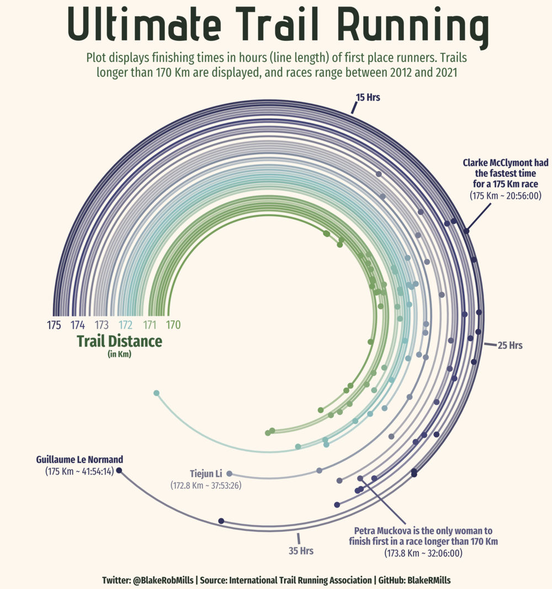

# Polar Plot Lines

## Introduction

The goal of my community contribution is to explain how to map coordinate line plots - I saw an example on someone else's github (link below) but have not seen much about them on the internet. I think they are visually quite cool and legible for continuous categorical data. Although they are circular and maybe are not the best way to perceive and compare values. I followed a lot of his method while augmenting with a few of my own styles and ideas.

This is the example I saw and was intrigued by:





For the data, I used data from my GoodReads account - tracking books I have read over the past few years. I am not including 2022. I also augmented 2017-2019 from memory since I didn't start logging books until 2020, so it's not totally accurate.

Github link: https://github.com/BlakeRMills/TidyTuesday/blob/main/2021/Ultimate%20Running%20(26%20Oct%202021)/Ultimate%20Running%20(26%20Oct%202021).R 

```{r, include=FALSE}
knitr::opts_chunk$set(echo = TRUE, message = FALSE, warning = FALSE)
```


```{r}
library(tidyverse)
library(ggplot2)
library(ggforce) # required for geom_link
library(RColorBrewer)
library(cowplot) # for draw_label
library(plotly)

# remotes::install_github("twitter/AnomalyDetection")
library("AnomalyDetection")
```

We'll need to add an order for the books to be in - so we'll group by year and keep the books spread out by a small sequence. If I had tracked the days that I read every book we would use that, but this serves as a proxy to have the lines be equally spaced.

```{r}
books <- read_csv("resources/polar_line_plots/book log.csv")

books <- books %>%
  arrange(desc(Year)) %>%
  mutate(Year = as.factor(Year),  # make sure not numerical
         book_order = seq(0, by = 0.25, length.out = n()), # set book order by equally spaced increments
         label = paste(Title, "\n", Author, "\n", "page count: ", `Page Count`)) # add label column
  
head(books)
```

## Base Chart

```{r, fig.width=6, fig.height=6, fig.align='center'}

colors <- brewer.pal(5, "Set2")

g1 <- ggplot(data=books, aes(color = Year)) +
   # add line segments
  geom_link(aes(x=book_order, xend=book_order, y=0, yend=`Page Count`), size=0.7, alpha=0.6) +
  geom_point(aes(y=`Page Count`, x=book_order, text = label), size=2.25) + 
  scale_color_brewer(palette = "Set2")+
  # start at 4.71 indicates where the lines start (the flat part)
  # theta = y sets variable y to be mapped (otherwise all radiate from origin - which also looks cool)
  coord_polar(theta = "y", clip = "off", start = 4.71) + 
  scale_x_continuous(limits = c(0, NA)) + #use NA in limits to control one end
  scale_y_continuous(limits = c(NA, 1000)) + # longest book is 925 pages
  theme_void()

g1
```

Looking at the chart now, it's probably actually not a great graph - it's quite difficult to tell the 2021 page counts from the 2020. It looks like the page counts of books in 2021 are a lot shorter compared to 2020 since the lines are shorter, when that's not necessarily the case. So while this chart looks visually interesting, it's not the most intuitive and it might be slightly misleading compared to a normal Cleveland Dot Plot.

But let's continue and make it prettier anyways.

## Remove Legend and Add Year Labels & Title

```{r, fig.width=6, fig.height=6, fig.align='center'}

# get label values for years

labels <- books %>%
  group_by(Year) %>%
  mutate(label_pos = mean(book_order)) %>%
  pull(label_pos) %>%
  unique()

g2 <- g1 +
  theme(legend.position = "none") +
  labs(title = "Book Page Count by Year") +
  # labels are in decreasing order, colors are in increasing order
  annotate(geom="text", label="'17", x = labels[5], y = 0, vjust = 1.5, color = colors[1], size = 3.5, family = "Helvetica") +
  annotate(geom="text", label="'18", x = labels[4], y = 0, vjust = 1.5, color = colors[2], size = 3.5, family = "Helvetica") +
  annotate(geom="text", label="'19", x = labels[3], y = 0, vjust = 1.5, color = colors[3], size = 3.5, family = "Helvetica") +
  annotate(geom="text", label="'20", x = labels[2], y = 0, vjust = 1.5, color = colors[4], size = 3.5, family = "Helvetica") +
  annotate(geom="text", label="'21", x = labels[1], y = 0, vjust = 1.5, color = colors[5], size = 3.5, family = "Helvetica") +
  theme(
    plot.title = element_text(color = "#636569", size = 16, family = "Helvetica", hjust = 0.5, vjust = -0.2)
    )

g2
```

## Add Labels for Page Counts

Here I want to add labels and line segments to the graph manually for the breaks, since this didn't work with the normal labels(breaks = (), labels = ()) method. I will keep labels on the outermost x layer so they're legible/don't interfere with the graph. This will improve the readability of the graph and make it easier to interpret. 

```{r, fig.width=6, fig.height=6, fig.align='center'}

g3 <- g2 +
  annotate(geom = "text", label = "300 pages", x = max(books$book_order)+2, y = 300, 
           size = 3, family = "Helvetica", color = "#636569", fontface = "bold") +
  annotate(geom = "segment", x = max(books$book_order), y = 300, 
           xend = max(books$book_order)+1.2, yend = 300,
           size = 0.5, color = "#636569") +
  annotate(geom = "text", label = "600 pages", x = max(books$book_order)+2, y = 600, 
           size = 3, family = "Helvetica", color = "#636569", fontface = "bold") +
  annotate(geom = "segment", x = max(books$book_order)-1, y = 600, 
           xend = max(books$book_order)+1, yend = 600,
           size = 0.5, color = "#636569") +
  annotate(geom = "text", label = "900 pages", x = max(books$book_order)+2, y = 900, 
           size = 3, family = "Helvetica", color = "#636569", fontface = "bold") +
  annotate(geom = "segment", x = max(books$book_order)-1, y = 900, 
           xend = max(books$book_order)+1.2, yend = 900,
           size = 0.5, color = "#636569")

g3

```

## Label a few of the books

Pick a few titles to display (mix of year and book length) to get a sense of positioning.
Picking x/y that looks the best is somewhat trial and error, start with the book_order value and the page count and move around from there.

I will start with using the exact values of the book order and page length for the x and y values and see where they land on the chart.

```{r, fig.width=6, fig.height=6, fig.align='center'}

g4_a <- g3 +
  annotate(geom = "text", label = "1Q84\n925 pgs", x = 11.5, y = 925, size = 2.5, color = colors[1], family = "Helvetica") +
  annotate(geom = "text", label = "Dune\n658 pgs", x = 1, y = 658, size = 2.5, color = colors[5], family = "Helvetica") +
  annotate(geom = "text", label = "Cutting\nfor Stone\n541 pgs", x = 8.25, y = 541, size = 2.5, color = colors[3], family = "Helvetica") +
  annotate(geom = "text", label = "Pachinko\n531 pgs", x = 9.75, y = 496, size = 2.5, color = colors[2], family = "Helvetica")


g4_a
```

That is quite difficult to read - so I played around with the adjustments of the text and added a line segment to clarify.

```{r, fig.width=6, fig.height=6, fig.align='center'}

g4_b <- g3 +
  annotate(geom = "text", label = "1Q84\n925 pgs", x = 9.2, y = 915, size = 2.5, color = colors[1], family = "Helvetica") +
  annotate(geom = "text", label = "Dune\n658 pgs", x = 2.8, y = 700, size = 2.5, color = colors[5], family = "Helvetica") +
  annotate(geom = "text", label = "Cutting\nfor Stone\n541 pgs", x = 8, y = 590, size = 2.5, color = colors[3], family = "Helvetica") +
  annotate(geom = "text", label = "Pachinko\n531 pgs", x = 13.8, y = 490, size = 2.5, color = colors[2], family = "Helvetica") +
  annotate(geom = "segment", x = 10, y = 525, xend = 12, yend = 500, size = 0.5, color = colors[2])


g4_b
```

This still isn't great, it would be better to have the dots be interactive - so first I will try with plotly.

## Make Labels Interactive with Plotly

coord_polar doesn't work with plotly: https://github.com/plotly/plotly.R/issues/491

This is what we get :/

```{r, fig.align='center'}

# make labels interactive

ggplotly(g3)

```


## Find another way to animate

After a bit of digging, there is another animation method, it's not as elegant/easy as plotly but it works with this case!
https://davidgohel.github.io/ggiraph/articles/offcran/using_ggiraph.html 

**(NOTE: you have to click the graph first to get the hover interaction working in html)**

```{r, fig.width=6, fig.height=6, fig.align='center'}
#install.packages("ggiraph")
library(ggiraph)

# start over with g1

g5 <- ggplot() +
  geom_link(data=books, aes(x=book_order, xend=book_order, y=0, yend=`Page Count`, color = Year), size=0.7, alpha=0.6) + # add line segments
  geom_point_interactive(data=books, aes(y=`Page Count`, x=book_order, text = label, color = Year, tooltip = label), size=2.25) + # use label column for interaction
  scale_color_brewer(palette = "Set2")+
  coord_polar(theta = "y", clip="off", start = 4.71) + # start at 4.71 indicates where the lines start (the flat part)
  scale_x_continuous(limits = c(0, NA)) + #use NA in limits to control one end
  scale_y_continuous(limits = c(NA, 1000)) + # longest book is 925 pages
  theme_void()

ggiraph(code = print(g5))

```

## Add Legend and Title Again

```{r, fig.width=6, fig.height=6, fig.align='center'}

g6 <- g5 +
   theme(legend.position = "none") +
  labs(title = "Book Page Count by Year") +
  # labels are in decreasing order, colors are in increasing order
  annotate(geom="text", label="'17", x = labels[5], y = 0, vjust = 1.5, color = colors[1], size = 3.5, family = "Helvetica") +
  annotate(geom="text", label="'18", x = labels[4], y = 0, vjust = 1.5, color = colors[2], size = 3.5, family = "Helvetica") +
  annotate(geom="text", label="'19", x = labels[3], y = 0, vjust = 1.5, color = colors[3], size = 3.5, family = "Helvetica") +
  annotate(geom="text", label="'20", x = labels[2], y = 0, vjust = 1.5, color = colors[4], size = 3.5, family = "Helvetica") +
  annotate(geom="text", label="'21", x = labels[1], y = 0, vjust = 1.5, color = colors[5], size = 3.5, family = "Helvetica") +
  theme(
    plot.title = element_text(color = "#636569", size = 16, family = "Helvetica", hjust = 0.5, vjust = -0.2)
    )

ggiraph(code = print(g6))

```

## Stylize tooltip labels

Now that we have the same base graph, we can fix how the labels look

```{r, fig.width=6, fig.height=6, fig.align='center'}
# add font options with css
# color = font color
# font-family = font
# font-type = bold/italic/underlined
# padding = padding around text
# border-radius = rounded corners of tooltip

tooltip_css <- "color:white;font-family:Helvetica;font-style:bold;padding:4px;border-radius:5px;"

girafe(ggobj = g6, 
  options = list(opts_tooltip(css = tooltip_css,
                              use_fill = TRUE), # fills the same color as the lines and points
                 opts_sizing(width = .7)
                 ))

```


## Conclusion/Review

Overall, this was a worthwhile exercise in better understanding polar coordinate graphs and their limitations when using Cartesian data. I am not sure that I would use this graph in practice as it is difficult to understand and visually misleading. For example, books in earlier years, such as Cutting For Stone and All the Light We Cannot See, have longer lines than books in 2021, such as Dune, making the page count seem longer, when in reality they are about 100 ages shorter. The polar coordinate plane does not lend to uniform, comparable lengths of the segments. The interactive points definitely help to understand the books, but it is also difficult to identify trends year over year with this graph. Perhaps this exercise functions as more of a critique of this type of graph than a how-to, but it was a fun exercise in learning how to make the graph and improving it's readability somewhat from the original version I saw online.  

