# Time Series Analysis in R

Sebastian Carter


```r
library(stats)
library(tidyverse)
library(forecast)
library(bayesforecast)
library(ggplot2)
```


## Introducing Time Series

Time series data consists of observations collected over a period of time. Often times with time series, observations are affected by the previous (or many preceding) points. For example, suppose you are collecting wind speed data. It is obvious that the wind speed at this current moment of time is dependent on the wind speed one minute ago. This characteristic makes time series analysis a unique area of study and requires us to build on our understanding and education in linear regression. In linear regression, we make the key assumption that error terms are independent. However, crucially, in time series data this is often not the case.

### EDA of Time Series Data

Time series data often has a seasonal component, a trend component, and an error term. We are familiar with the linear regression model,
$$
Y_i = \beta_0 + \beta_1X_i + \epsilon_i
$$
or more qualitatively,
$$
Y = \text{trend} + \epsilon .
$$

Similarly, we can write time series data in the following form:

$$
Y_t = \text{seasonal}_t + \text{trend}_t + \epsilon_t
$$

In the above equation, we have denoted $\{Y_t\}$ to be the time series data of interest, say wind speed. Eventually, we will attempt to "de-trend" $\{Y_t\}$, which essentially means removing the seasonal and trend component from the data. First, let's examine methods to identify these components.

We will use the `decompose` function, which is a very helpful tool for data scientists to conduct a quick analysis of seasonal and trend components of time series data. 

#### Example

In this example, we examine the maximum temperature in Boston per month. The first plot displays the measured data. The second plot displays the trend, which is typically calculated using a moving average. Next, the season trend is determined and displayed. The final plot displays the residuals, which is the data after subtracting the trend and seasonal components of the data.


```r
BosTemp = read.csv("resources/timeseriesanalysis/boston_monthly_tmax_1998_2019.csv")

BosTemp$DateTime = as.Date(BosTemp$Date, "%m/%d/%Y")
ts(BosTemp[,2], frequency = 12, start = c(1998,1)) %>% decompose %>% autoplot
```

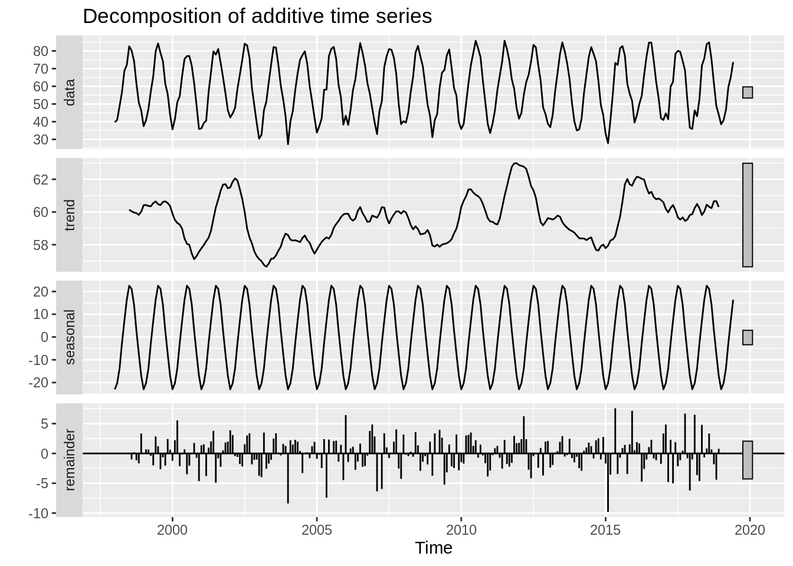

##### Important Data Wrangling


As with most data visualization tools, the `decompose()` and `autoplot()` functions take in a `ts` object. The `decompose` function will not accept a dataframe of time series data that we are familiar with. We must convert the dataframe into a time series object. 

Below is a preview of the data we have loaded.  


```r
head(BosTemp %>% select(DateTime, Monthly.Average.Maximum))
```

```
##     DateTime Monthly.Average.Maximum
## 1 1998-01-15                   39.71
## 2 1998-02-15                   40.97
## 3 1998-03-15                   48.75
## 4 1998-04-15                   56.74
## 5 1998-05-15                   68.75
## 6 1998-06-15                   72.00
```

The `ts` function can be used to convert this dataframe into a time series object. The first argument in the `ts` function take the data (in vector or matrix form), the "start" argument takes the time of the first observation, and the frequency function takes the number of observations per unit of time. So, for this example, we have monthly data that starts in 1998, so `start = 1998` and `frequency = 12`. 

So, below is the Boston temperature data converted into a time series object, which will be accepted by `autoplot()`. 

```r
BosTemp_ts = ts(BosTemp[,2], frequency = 12, start = c(1998,1))
head(BosTemp_ts,12*5)
```

```
##        Jan   Feb   Mar   Apr   May   Jun   Jul   Aug   Sep   Oct   Nov   Dec
## 1998 39.71 40.97 48.75 56.74 68.75 72.00 82.62 80.20 74.44 61.59 50.77 46.30
## 1999 37.46 40.79 47.23 57.27 65.65 79.87 84.20 78.94 74.24 61.42 55.57 43.94
## 2000 35.68 41.42 51.07 54.40 65.91 75.44 77.07 77.10 71.64 61.68 49.17 35.88
## 2001 36.17 39.18 40.62 56.70 67.97 79.74 77.88 81.10 73.34 65.00 56.14 46.39
## 2002 42.42 44.61 47.81 58.64 66.71 75.00 84.04 83.17 76.10 59.07 49.14 39.23
```

### Autocorrelation Plot (ACF)

After we have de-trended the data, we want to examine the residuals in order to understand the error structure (and eventually be able to forecast). The Autocorrelation Plot (ACF) is a very important tool in time series EDA as it can give us insights into the error structure and help us determine an appropriate model. The ACF plot basically calculates and displays the correlation coefficient between a time series and its lagged values. For example, the lag 1 autocorrelation is the correlation between $X_t$ and $X_{t-1}$ for all $t>1$. Likewise, lag 2 autocorrelation is the autocorrelation between $X_t$ and $X_{t-2}$, i.e. the correlation between the $t^{th}$ observation and the ${(t-2)}^{th}$ observation. 

We will use the `ggacf` function within the `bayesforecast` package to create an autocorrelation plot (also known as a correlogram).

#### Example

For iid error, we do not expect correlation between lags. Below is an acf plot of iid error. If multiple black lines cross the dashed blue line boundaries, we may reject the null hypothesis that the lags are uncorrelated. 


```r
t = 1:100
error = rnorm(100)
Y = 2*t +error 

df = data.frame(t, Y)

model = lm(Y ~ t, data = df)

ggacf(residuals((model)))
```

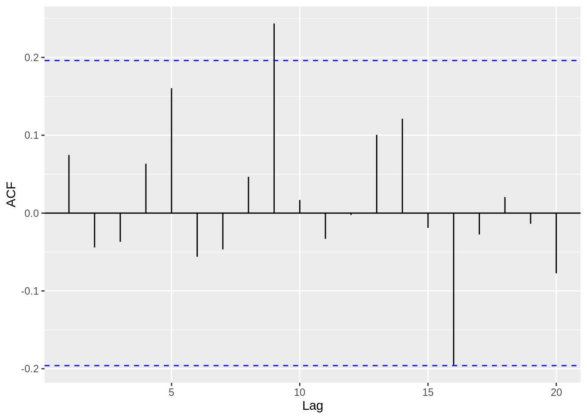

#### Example

Now, let's examine a case where the errors are correlated, and demonstrate how the ACF plot is very useful in identifying this characteristic. Again, we will use the Boston temperature dataset.


```r
ggacf(BosTemp_ts)
```

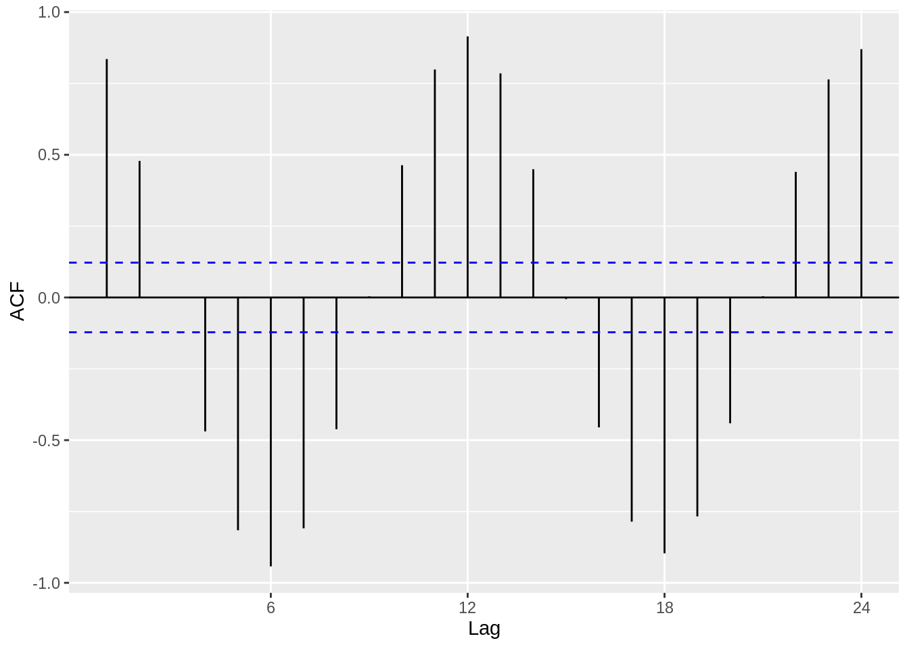

Clearly, we observe a harmonic trend, since we have not removed the seasonal or trend components from the data. However, we can extract the de-trended time series data from the decompose function that we used earlier. The residuals look much more iid than before, and this is a good first step in modelling the time series data.


```r
ggacf((BosTemp_ts %>% decompose)$random)
```

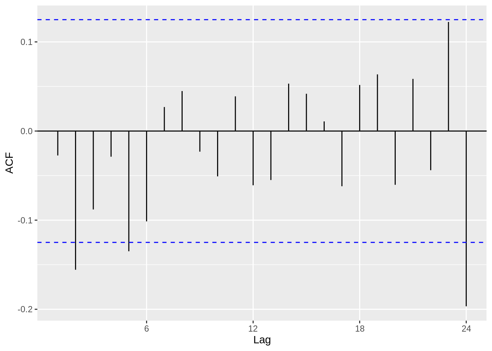

### Partial Autocorrelation Plot (PACF)

The PACF is similar to the ACF plot in that it displays autocorrelation between observations and their lags, however the PACF removes the effects of other lags. Intuitively speaking, if observations are affected by the previous observation, we will see a high correlation coefficient at lag 1. However, thinking recursively, this will mean an observation is also affected by its lag 2 (i.e. the lag 1 of its lag 1). As a result, in the ACF plot, we will see a significant correlation coefficient at lag 2, and so forth (albeit more muted than lag 1). The PACF plot, however, eliminates the influence of other lags. So, for an AR(p) process, which is a time series model that basically determines a relationship between an observation and the previous p observations, we can use a PACF plot to determine the p. 

#### Example

So, let's use a dataset where we can bring together everything we have looked at so far -- the decompose function, autoplot, the acf plot and finally the pacf -- and then go a step further where we attempt to identify a suitable model using the acf/pacf plots.


```r
Ex_data = read.csv("resources/timeseriesanalysis/TS_data.csv")

Ex_data_ts = ts(Ex_data[,2], start = 1900, frequency = 2)

ggacf(Ex_data_ts)
```

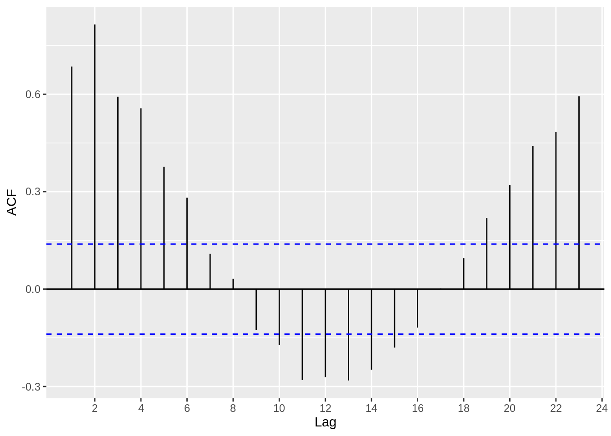

```r
Ex_data_ts %>% decompose() %>% autoplot()
```

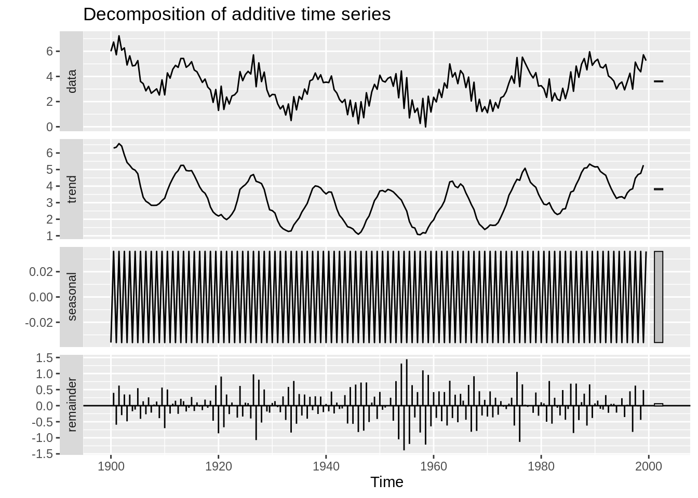

```r
ggacf((Ex_data_ts %>% decompose())$random)
```

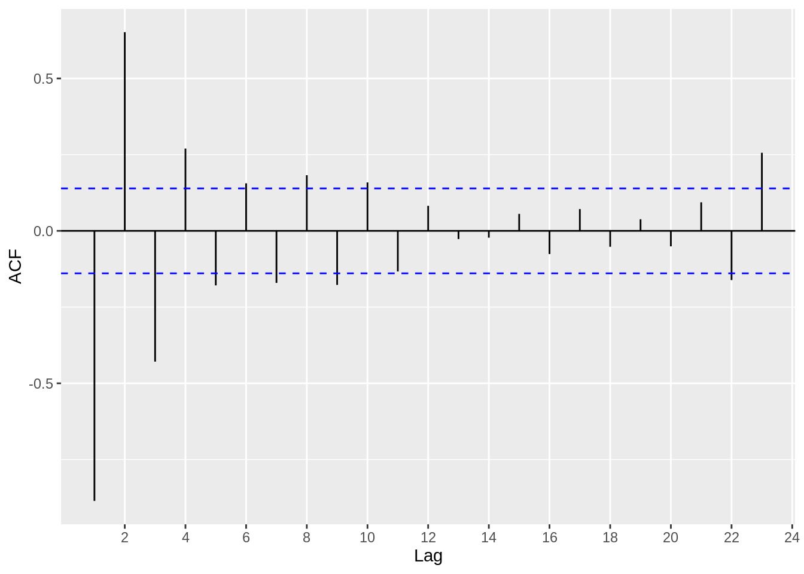

Based on the acf plot, we can definitely see that a AR(p) process is suitable, since the first few lags have high correlation coefficients. Now, let's use a pacf plot to investigate further.


```r
ggpacf((Ex_data_ts %>% decompose())$random)
```

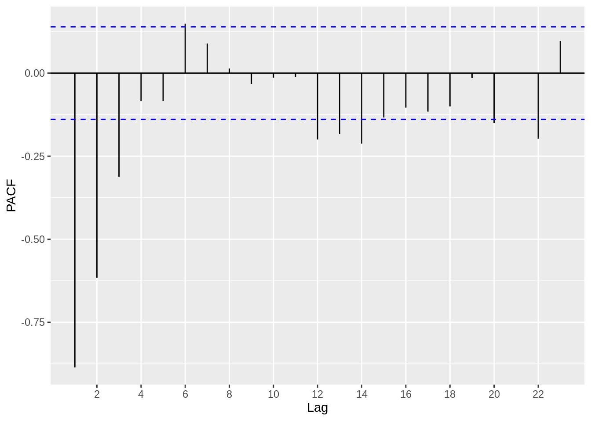

Based on the plot above, we can estimate that an AR(2) or AR(3) model might be suitable, since the correlation coefficients get close to zero starting at around lag 3 and lag 4. 


### Forecasting

Forecasting time series data is one of the most important aspects of time series analysis. In order to forecast, we ought to examine certain properties of the time series processes (such as AR, MA, and ARMA) that we believe estimate our data well. For reference, the AR(1), MA(1) and ARMA(1,1) models are written below, respectively. 

$$
X_t = \phi X_{t-1} +Z_t, Z_t  \sim WN(0,\sigma^2)
$$

$$
X_t =  \theta Z_{t-1} + Z_t, Z_t  \sim WN(0,\sigma^2)
$$

$$
X_t - \phi X_{t-1} =  Z_t + \theta Z_{t-1} , Z_t  \sim WN(0,\sigma^2)
$$

*Causality and Invertibility* are essential characteristics in a time series process. Causality implies that the time series process can be estimated using past observations (as opposed to future observations) and invertibility means that the errors (see the $Z_t$ terms) can be represented by the past observations. Without getting into the mathematics behind it, causality can be determined by analyzing the roots of the $X_t - \phi X_{t-1}$ polynomial. If the absolute values of the roots are greater than 1, we say the process is causal. 

Similarly, invertibility can be determined by analysing the roots of the $Z_t + \theta Z_{t-1}$ polynomial. If the absolute values of the roots are greater than 1, we say the process is invertible. 

R has a very useful function that allows us to quickly and easily determine the roots and therefore examine the causality and invertibility of a time series process.


#### Example

Extending upon the data in the PACF example, we will determine the causality using the roots method. We can use the `Arima()` function from the `forecast` package in order to model the data, and then the `autoplot()` function will visualise the unit circle and the **inverse** roots. *If the inverse roots are within the circle, the time series is causal.* Per the analysis we conducted using the PACF plot, we will use the AR(3) model on the data.


```r
Ex_data$X_1 = NA 
Ex_data$X_1[2:200] = Ex_data$X[1:199]

Ex_data$X_2 = NA 
Ex_data$X_2[3:200] = Ex_data$X[1:198]

Ex_data$X_3 = NA 
Ex_data$X_3[4:200] = Ex_data$X[1:197]

model = lm(X ~ X_1 +X_2 +X_3 , data = Ex_data)

summary(model) 
```

```
## 
## Call:
## lm(formula = X ~ X_1 + X_2 + X_3, data = Ex_data)
## 
## Residuals:
##     Min      1Q  Median      3Q     Max 
## -1.5192 -0.5453  0.0193  0.4628  1.8945 
## 
## Coefficients:
##             Estimate Std. Error t value Pr(>|t|)    
## (Intercept)  0.36799    0.14234   2.585   0.0105 *  
## X_1          0.29241    0.07153   4.088 6.38e-05 ***
## X_2          0.72885    0.05236  13.921  < 2e-16 ***
## X_3         -0.13416    0.07100  -1.890   0.0603 .  
## ---
## Signif. codes:  0 '***' 0.001 '**' 0.01 '*' 0.05 '.' 0.1 ' ' 1
## 
## Residual standard error: 0.7006 on 193 degrees of freedom
##   (3 observations deleted due to missingness)
## Multiple R-squared:  0.7362,	Adjusted R-squared:  0.7321 
## F-statistic: 179.6 on 3 and 193 DF,  p-value: < 2.2e-16
```

```r
Ex_data_ts %>% 
  Arima(order = c(3,0,0))%>% autoplot
```

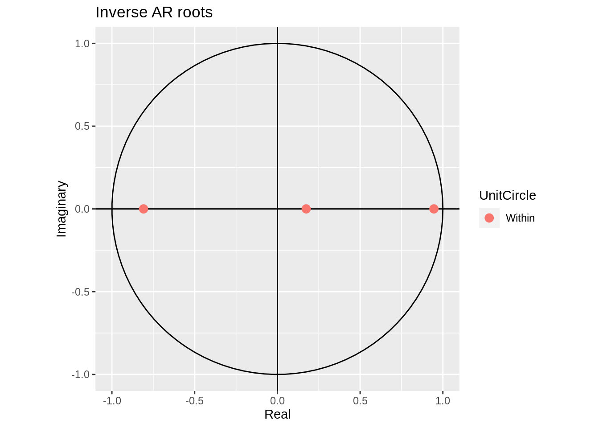

#### More examples

In order to drive home this concept, we will simulate a a couple AR and ARMA processes and visualise their unit roots.


##### ARMA(3,2)


```r
my_ARMA_sim <- function(n,ma_coeff,ar_coeff,sigma=1) {
  n.start <- n + floor(.2/(1-.2)*n)
  burnin <- floor(.20*n.start)
  model_params <- list(ma = ma_coeff,ar=ar_coeff)
  ts_sim <- arima.sim(model = model_params, n = n.start,sd=sigma)
  ts_sim <- ts_sim[(burnin+1):n.start]
  return(ts_sim) 
}

n=1000
ar_coeff=c(.4,.4,.1)
ma_coeff=c(.4,.5)
sigma <- 1
AMRA_sim <- my_ARMA_sim(n=n,ma_coeff=ma_coeff,ar_coeff=ar_coeff,sigma=sigma)

ts(AMRA_sim, frequency = 10, start = c(1900)) %>% 
  Arima(order = c(3,0,2))%>% autoplot
```

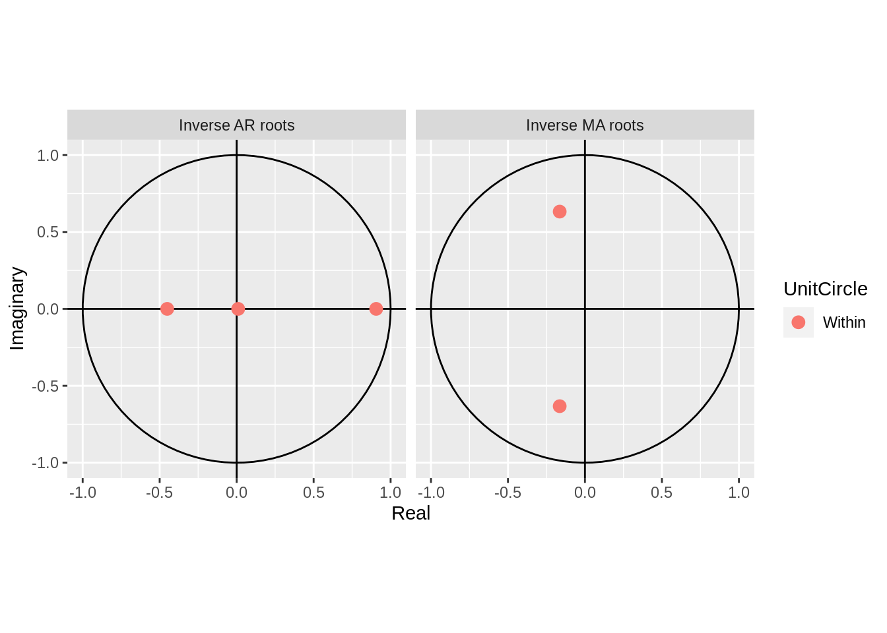

##### AR(2)


```r
my_AR_sim <- function(n=189, ar_coeff,sigma=1) {
    n.start <- n + floor(.2/(1-.2)*n)
    burnin <- floor(.20*n.start)
    model_params <- list(ar = ar_coeff)
    ts_sim <- arima.sim(model = model_params, n = n.start,sd=sigma)
    ts_sim <- ts_sim[(burnin+1):n.start]
    return(ts_sim)
}

ar_sim <- my_AR_sim(n=n,ar_coeff=0.5,sigma=sigma)

ts(ar_sim, frequency = 1, start = c(1900)) %>% 
  Arima(order = c(1,0,0))%>% autoplot
```


#### Forecasting Functions

After conducting EDA and examining causality/invertibility, we can begin forecasting. R has a few functions which are very helpful in this area. The `forecast` package includes a function called `forecast` that takes a model as a parameter and extrapolates it to future time periods. The `ets` function below is an exponential smoothing model. The blue line represents the estimated value and the shaded purple areas are the confidence bands for that estimate.


```r
USAccDeaths %>%
  ets() %>%
  forecast() %>%
  autoplot()
```

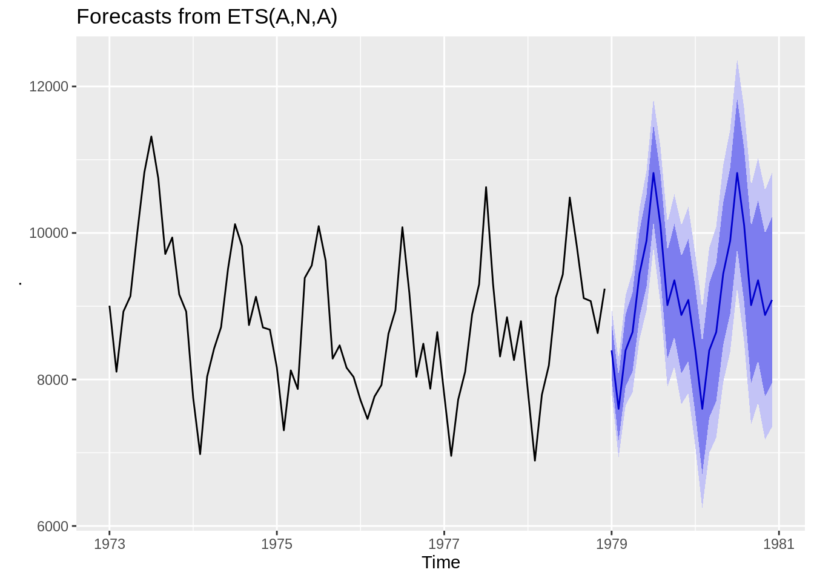

We can also use the `Arima` function to estimate an ARMA model and then use it to forecast future values. Using the ARIMA on the simulated AR(2) model we created earlier.


```r
ts(ar_sim, frequency = 1, start = c(1900)) %>% 
  Arima(order = c(2,0,0)) %>%
  forecast() %>% 
  autoplot(ylab = "Simulated AR(2)") 
```

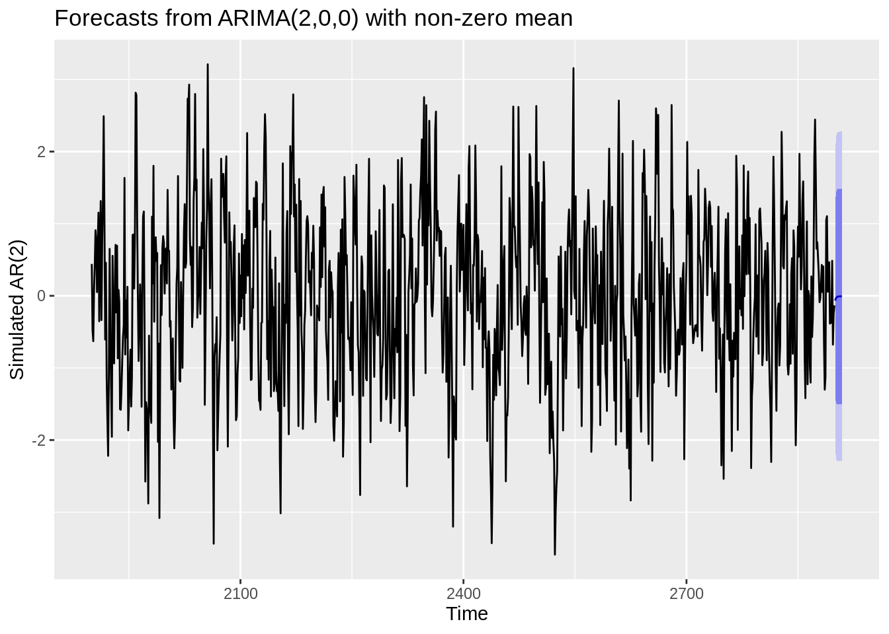


### Recap

The motivation for this project was to demonstrate how to conduct time series analyses in R in a straightforward and practical way. I wanted to extract the critical components of the theory behind time series analysis and apply it to real data. I tried to find a balance between highlighting mathematical equations and concepts, without getting lost in the weeds and straying from the practical applications. In this tutorial, I highlighted exploratory data analysis techniques, including utilising the acf and pacf plots, and decomposing the data into seasonal and trend components. Then, I explained methods to analyze the error structure of de-trended data, and highlighted a couple methods to forecast data in an suitable way. With more time and resources, I would further explore forecasting methods in R and expand on other characteristics of stationary time series data that are important to consider. Whilst I had a basic understanding of the fundamental time series concepts, this project strengthened my grasp of time series analysis and exposed me to practical methods to applying the theory in R. Additionally, I feel that creating this tutorial helped me better understand the theoretical concepts of time series and identify the significance (or the "so what") of many of these theories. I found it helpful to connect the time series concepts to linear regression concepts that we have been trained in as statistics students. I came to realize how time series builds and expands on many of the concepts we are familiar with through our stats training so far.


